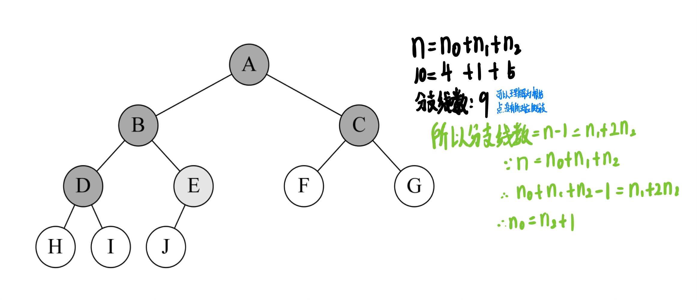
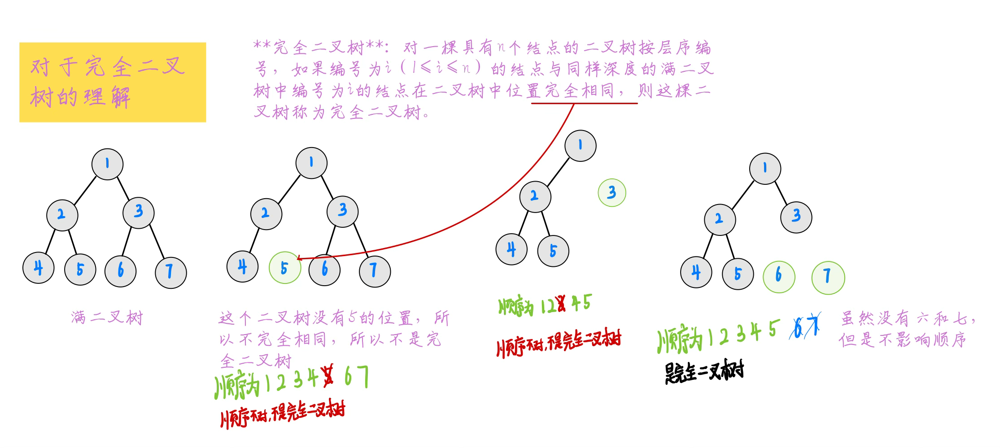

# 二叉树

### 二叉树的定义

**二叉树（Binary Tree）**是n（n≥0）个结点的有限集合，该集合或者为空集（称为空二叉树），或者由一个根结点和两棵互不相交的、分别称为根结点的左子树和右子树的二叉树组成。

### 二叉树的特点

* 二叉树不存在度大于2的结点，也就是最多两个子树
* 二叉树的子树有左右之分不可以随便颠倒
* 二叉树具有递归性质

### 二叉树的性质

1. 二叉树的第i层最多有$2^{i - 1}$。
2. 深度为h的二叉树最多有$2^h-1 $个结点
3. **对任何一棵二叉树T，如果其度为0的结点数为$n_0$，度为2的结点数为$n_2$，则$n_0=n_2+1$。**

* 第一种理解方式（计算）




* 这么理解也可以：
	* 度为0增加节点的话，就是增加一个度为0的节点，再减少一个度为0的节点
	* 度为1增加节点的话，就是增加一个度为0的节点，再增加一个度为2的节点

4. 高度为h的完全二叉树，结点的数量范围是$[2^{h-1},2^h-1]$。这个可以根据结点的数量n逆推高度h$h=\log_2n$**进一法处理小数**。

### 特殊的二叉树

##### 斜树：所有的结点都只有左子树的二叉树叫左斜树。所有结点都是只有右子树的二叉树叫右斜树。这两者统称为斜树。

**满二叉树**：**每一层的结点**都达到**最大值**。 如果二叉树的层数为k，则结点总数为$2^k-1$（用等比数列或者错位相减算出来）。高度为$h=\log_2(N+1)$。

* 叶子只能出现在最下一层。
* 非叶子结点的度为2。
* 在同样深度的二叉树中，满二叉树的结点个数最多，叶子数最多。

**完全二叉树**：对一棵具有n个结点的二叉树按层序编号，如果编号为i（1≤i≤n）的结点与同样深度的满二叉树中编号为i的结点在二叉树中位置完全相同，则这棵二叉树称为完全二叉树。~~抽象~~



**完全二叉树的特点**：

1. 叶子结点只能出现在最下两层。
2. 最下层的叶子一定集中在**左部连续位置**。
3. 倒数二层，若有叶子结点，一定都在**右部连续位置**。
4. 如果结点度为1，则该结点只有左孩子，即不存在只有右子树的情况。

### 二叉树的链式存储

* 适用于空间浪费的
* 普通二叉树没有意义
  * 存储数据为了好看？
  * 结构很复杂，不如用`链表`和`数组`存数据
  * 不学增删查改，因为没有意义
  * 加上性质之后有意义了
  * **搜素二叉树**：左子树的数值比根小，右子树比根大 
  * 天生用来查找，跟二分查找很像
    * 二分查找的问题在于要在数组里面（下标）（有序）并且不适合增删查改**条件很苛刻**
  * 二叉树也有问题就会衍生出红黑树
  * 常用的数据管理：
    * 平衡二叉搜索树~~（从入门到放弃）~~
    * 哈希表
    * B树
* 不用造轮子但是必须会写
* 普通二叉树为了之后打基础
* 为了考试
* 不学增删查改了，因为不太重要，但是要学结构

#### 前序，中序，后序和层序遍历

前序，中序，后序遍历中**每一个树**都要看成三个部分

* 根 左子树 右子树

所以用**递归**解决，区别就是**访问根的时机不同！！**


遍历方式：

* 前序遍历：**根 左子树 右子树** 

  

  ```c
  void PreOrder(BTNode* root)//采用递归定义前序遍历
  {
  	if (root == NULL) {
  		printf("NULL ");
  		return;
  	}
  
  	printf("%d ", root->data);
  	PreOrder(root->left);
  	PreOrder(root->right);
  }
  ```

  

* 中序遍历：左子树 根 右子树

  

  ```c
  void InOrder(BTNode* root) //使用递归定义中序遍历
  {
  	if (root == NULL) {
  		printf("NULL ");
  		return;
  	}
  
  	InOrder(root->left);
  	printf("%d ", root->data);
  	InOrder(root->right);
  }
  ```

  

* 遍历：左子树 右子树 根

  * 图片略：`NULL NULL 3 NULL 2` `NULL NULL 5 NULL NULL 6 4 `1 

```c
void PostOrder(BTNode* root)//使用递归定义后序遍历
{
	if (root == NULL)
	{
		printf("NULL ");
		return;
	}

	PostOrder(root->left);
	PostOrder(root->right);
	printf("%d ", root->data);
}
```


* 层序遍历：1 2 4 3 5 6 **不用递归** *这里数值有更新* 328-2128 

**出上一层，下一层进入队列**

```c
void LevelOrder(BTNode* root)
{
	Queue q;
	QueueInit(&q);
	if (root)
		QueuePush(&q, root);

	while (!QueueEmpty(&q))
	{
		BTNode* front = QueueFront(&q);
		QueuePop(&q);
		printf("%d ", front->data);

		if(front->left)
			QueuePush(&q, front->left);

		if (front->right)
			QueuePush(&q, front->right);
	}

	QueueDestroy(&q);
}
```


#### 求二叉树节点的数量

```c
int size = 0;//全局变量
void TreeSize(BTNode* root)
{
	if (root == NULL)
		return;

	++size;
	TreeSize(root->left);
	TreeSize(root->right);
}
```

这样的写法有一些问题：

* 多次调用会导致全局变量多次相加，导致数值不对
  * 解决方案：每次调用前清零全局变量

另一种写法：

```c
void TreeSize(BTNode* root, int* psize)
{
	if (root == NULL)
		return;

	++(*psize);//传地址就可以
	TreeSize(root->left, psize);
	TreeSize(root->right, psize);
}
```

#####  分治求节点数量

```c
int TreeSize(BTNode* root)
{
	return root == NULL ? 0 : 
			TreeSize(root->left) //左树
			+ TreeSize(root->right) //右树
			+ 1;//自己所在的节点
}
```

#### 求深度

分解成子问题：**当前的高度等于左右子树高度大的+1**

```c
int TreeHeight(BTNode* root)
{
	if (root == NULL)
		return 0;

	return TreeHeight(root->left) > TreeHeight(root->right)
		? TreeHeight(root->left) + 1 : TreeHeight(root->right) + 1;
}
```

这个写法不太好，节点（`TreeHeight(root->left)`和`TreeHeight(root->right)`）要遍历很多次，没有保存`TreeHeight(root->left)`和`TreeHeight(root->right)`的数值所以要重新遍历。

第一次是比较，第二次获得数值

所以：时间复杂度为$O(2^n)$

优化代码为：

```c
int TreeHeight(BTNode* root)
{
	if (root == NULL)
		return 0;

	int leftHeight = TreeHeight(root->left);   //保存的结果
	int rightHeight = TreeHeight(root->right);

	return leftHeight > rightHeight ? leftHeight + 1 : rightHeight + 1;
}
```

#### 求第K层的节点个数

```c
int TreeKLevel(BTNode* root, int k)
{
	assert(k > 0);

	if (root == NULL)
		return 0;
	
	if (k == 1)
		return 1;

	return TreeKLevel(root->left, k - 1)
		+ TreeKLevel(root->right, k - 1);
}
```

#### 查找值为X的结点 328-1910

返回值有问题，会误以为返回值直接返回到最外层。

* 保存临时地址返回就可以（**层层递归把指针带出去**）

```c
BTNode* TreeFind(BTNode* root, BTDataType x)       //返回值是指针为了方便修改
{
	if (root == NULL)
		return NULL;

	if (root->data == x)
		return root;

	BTNode* lret = TreeFind(root->left, x);
	if (lret)
		return lret;

	BTNode* rret = TreeFind(root->right, x);
	if (rret)
		return rret;

	return NULL;
}
```

另一种写法

```c
BTNode* TreeFind(BTNode* root, BTDataType x)
{
	if (root == NULL)
		return NULL;

	if (root->data == x)
		return root;

	BTNode* lret = TreeFind(root->left, x);
	if (lret)
		return lret;

	return TreeFind(root->right, x);
}
```

##### 检查两颗树是否相同328-1934

##### 二叉树的前序遍历 328-1948

##### 另一棵树的子树 328-2025

##### KY11 二叉树遍历 328-2044

